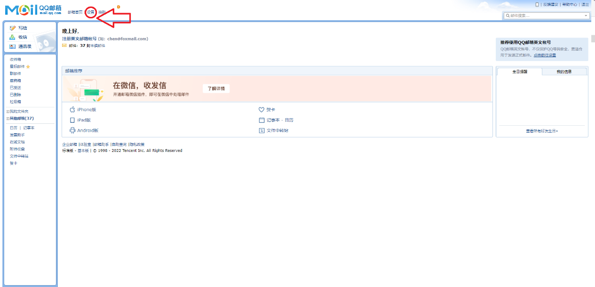
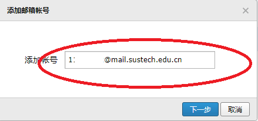
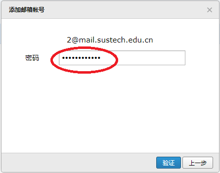
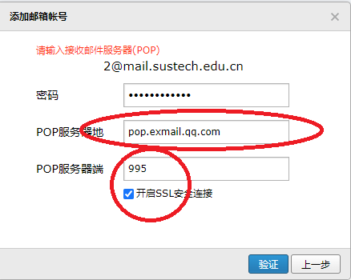

# 解决邮箱容量不足的问题

by 贾纪源

## 要求
1. 有足够空间的 `个人QQ邮箱A`
2. 容量不足的邮箱（以下用 `企业邮箱B` 举例）提供 POP3（Post Office Protocol 3）服务

## 具体效果与配置注意事项
1. 在 `企业邮箱B` 中删除邮件，`个人QQ邮箱A` 中存储的 `企业邮箱B` 的邮件不会被删除，以达到备份邮件、清理 `企业邮箱B` 空间的效果。
2. 在 `个人QQ邮箱A` 中收取 `企业邮箱B` 的邮件，收件人依然保持显示 “`企业邮箱B`。
3. 在 `个人QQ邮箱A` 中发送或回复 `企业邮箱B` 的邮件，发件人将显示为 “`企业邮箱B` 发送 （以 `个人QQ邮箱A`） 代发”。
4. 由 `企业邮箱B` 的垃圾邮箱策略，垃圾箱中的邮件可以不会被 `个人QQ邮箱A` 收取。
5. 部分邮件服务商的POP3协议使用**客户端密码**，而不是网页账号密码。

## 操作步骤

1. 打开 `个人QQ邮箱A`，进入设置

    

2. 选择其他邮箱

    

3. 添加其他邮箱账户（`企业邮箱B`）

    

4. 输入学校邮箱账号

    

5. 输入学校邮箱密码，点击验证

    

6. 输入POP服务器和端口点击验证

    

