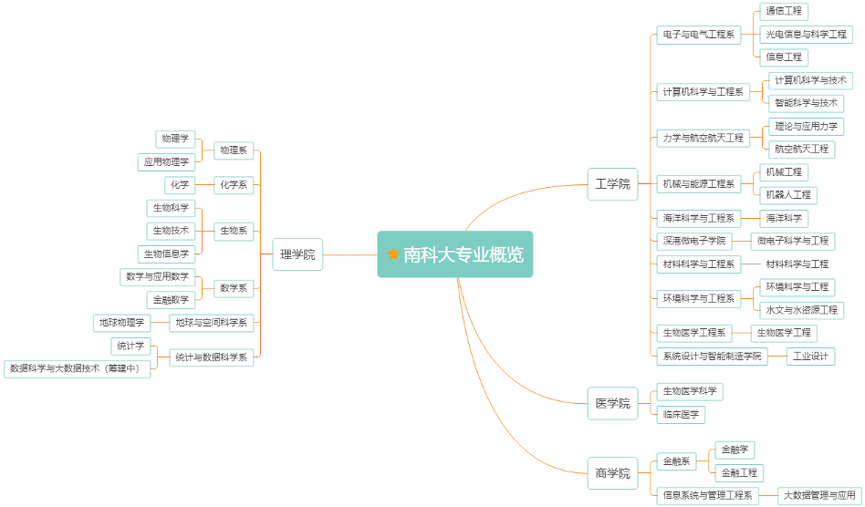
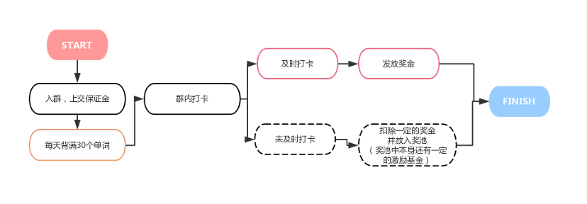
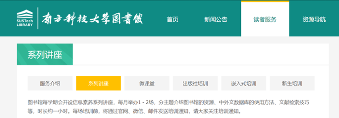
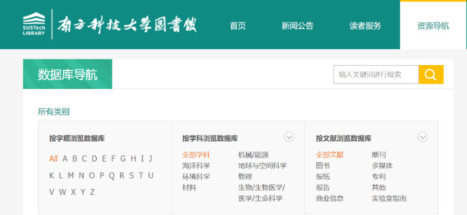

# 📖学习制度与信息

**包含GPA表、专业概览、选课指导、学习资源、图书馆学习攻略、学籍管理。**

*由树德书院**徐思婷**编写，陈臻洋整理。*

## 序言

经过一个暑假，九月到来之时，大家就要开始在南科大的学习生活啦！我们整理了一些学习制度相关的内容，在正式开始大学生活之前，这一部分的内容尤其重要。由于大学与高中的学习差别比较大，了解这些内容可以帮助大家更好地适应大学的学习生活，调整好自己的学习节奏，制定好自己的长期或短期计划。

## GPA表

高中和大学最明显的区别就是成绩的构成啦。 南科大有两种计分方式，一种是十三级计分制，一种是二级计分制，具体计分标准看下面：

### 十三级计分制（计入GPA）

| 等级       | A+       | A       | A-      | B+      | B       | B-      | C+      | C       | C-      | D+      | D       | D-      |  F   |
| ---------- | -------- | ------- | ------- | ------- | ------- | ------- | ------- | ------- | ------- | ------- | ------- | ------- | :--: |
| 绩点       | 4.00     | 3.94    | 3.85    | 3.73    | 3.55    | 3.32    | 3.09    | 2.78    | 2.42    | 2.08    | 1.63    | 1.15    |  0   |
| 百分  参考 | 97~  100 | 93~  96 | 90~  92 | 87~  89 | 83~  86 | 80~  82 | 77~  79 | 73~  76 | 70~  72 | 67~  69 | 63~  66 | 60~  62 | <60  |

::: tip

推荐使用同学开发的[网页版GPA计算器](https://github.com/chenyuheng/SUSTech-GPA-Calculator)快速计算GPA。

:::

### 二级计分制（不计入GPA）

以通过（P，Pass）、不通过（F，Fail）方式记载成绩的课程。成绩为通过的，计入学分，不计入平均学分绩点（GPA）；成绩为不通过的，既不计入学分，也不计入平均学分绩点。

### 平均学分绩点（GPA）的计算方式

一门课的学分绩 = 绩点 × 学分数

平均学分绩点（GPA） = 所修课程学分绩求和 / 所修课程学分数求和

#### 一个小例子

高数学分为4，成绩87；大物学分为4，成绩86；JAVA学分为3，成绩91

高数学分绩 = 3.73×4 = 14.92；大物学分绩 = 3.55×4 = 14.2；JAVA学分绩 = 3.85×3 = 11.55

GPA =（14.92 + 14.2 + 11.55）÷（4 + 4 + 3）= 3.69727272…

::: tip

大学的成绩和高中不同的是，大学的成绩构成由平时表现和期末考试成绩构成，平时表现包括出勤、作业、presentation等等，每门课第一节课老师都会介绍课程成绩的构成，一定要好好听哦。

:::

## 专业概览

## 选课指导

来了南科大，还有一点和高中不一样的是，高中时期课表都是学校安排好的，而在南科大，你需要自己安排好自己的课表。安排课表的时候，需要考虑自己的作息、不同课程的上课地点、一天的课程容量等等，安排课表的时候，可以多多咨询自己的导师和学长学姐们。在这里，我们会简要地介绍一下选课退课的时间安排与流程。

**选课流程：<u>了解培养方案与课程→新生课程初选→导师指导→课程退补选→书院确认</u>**

### 了解培养方案与课程

新生来校后将会分发**2020****级培养方案**，其中不同的专业会有不一样的培养方案与课程建议修读学期，选课前一定要仔细阅读纸质版2020级培养方案哦。

### 新生课程初选

在秋季学期正式开学前一周教务系统将会开放进行选课。春秋季学期选课均采用**积分制选课**，到时候每个人都会有100分，选课的时候需要将100分进行分配到所选择的各个课进行投注，是对博弈论进行的一场操练哦。每学期选课的总量把握在**15-25**学分之间**。教务系统具体开放时间将会由教学部学生服务中心发邮件通知。一定要多查看邮件！**

### 导师指导

选课期间可以向书院导师咨询选课意见，后期可以将导师的选课意见填写在导师指导选课意见表中。这也是一个可以跟导师好好交流的机会~

### 课程退补选

春秋季学期的**1-3**周都是自由退课时间，这段时间可以在教务系统自行退课，成绩单不做记录；同时，退的课将会在对应的课中多出名额，**1-3周每天中午13点**整将会释放这些名额供学生们进行补选（有时候这样的“抢课”相当激烈，12：59就可以守在电脑前等待释放的名额啦，不失为大学生活的一种乐趣）。

春秋季学期的**4-8**周可以到教学工作部学习服务中心进行退课，在此期间退课成绩单上将会记录“W”（Withdrawal退课）。

**第9周**起不允许退课。

> 附：教学工作部联系方式（选课、加课、打印成绩单、在读证明…）
>
> 办公地点：慧园3栋203、206
>
> 办公时间：周一至周五 上午8:30 - 12:00，下午14:00 - 17:30
>
> 公共邮箱（教学事务）：[tao@sustech.edu.cn](mailto:tao@sustech.edu.cn)
>
> 学生学习服务邮箱：[tao-sls@sustech.edu.cn](mailto:tao-sls@sustech.edu.cn)
>
> 官网：[http://tao.sustech.edu.cn/index.html](http://tao.sustech.edu.cn/index.html)

## **一些**学习资源

南科大有很多学习资源！以下会列举一部分，在未来的日子里你们会需要这些哒。

1. 学生工作部学习中心有**针对通识基础必修课的互助课堂**，同时，各个书院也有性质类似的**学生课堂**。

2. 语言中心提供**口语、写作辅导、托福、雅思、四六级培训**等学习资源。

3. 各个院系也会组织**参观实验室**的活动，对某个方向感兴趣的同学也可以主动联系导师申请**加入课题组**。

4. 南科大图书馆官网[网络资源导航](https://lib.sustech.edu.cn/download/network.html?locale=zh_CN)：（包括数据库、网络公开课、工具等）

5. 树德学生会

   - **【学生会·英语单词打卡】**

     

     树德学生会的英语单词打卡旨在通过**督促、惩罚、奖励**等多种措施，在一个温馨高效的学习氛围里，帮助同学们养成背单词的习惯。

     > 打卡QQ群：1049298186

   - **【学生会·实验室参观】**

     学生会学创部会定期联系各院系各专业，并发布预告，组织一定数量的同学去到该专业。想参加的同学可以报名，听取教授讲解**专业知识**，进入实验室**实践或参观**，和学长学姐**交流碰撞**，更加深层次的了解一个专业。

   - **【学生会·学创刊】**

     学创刊是学生会学创部针对同学们需求出品的期刊。包含内容有**竞赛消息发布**、**语言学习秘籍公开**、**课程学习指导**、**优秀学长学姐经验访谈**等多板块内容，旨在为同学们提供多手资料，帮助大家度过丰富充实的大学四年。

6. 除了这些资源，**身边的老师和同学**也是很好的学习资源，有问题可以多向老师同学请教探讨。学习是**主动**的过程，只有主动才能获取到这些资源鸭。

### 图书馆学习攻略

1. 图书馆是南科大学生平常学习的好地方！进图书馆一定要记得带上**校卡**刷卡进入哦。

2. 图书馆的服务时间是周一至周日8:00 - 22:00，疫情期间可能有所变化，开馆时间有任何变化图书馆都会通过发邮件告知大家，大家要**记得多查邮箱哦**。

3. 琳恩图书馆各个楼层功能：

   一楼：休闲区、报刊区、阅览室、共享学习区、讨论室

   二楼：阅览区、小组活动区

   三楼：电子阅览室、自习区

   ::: tip

   关于一楼的讨论室：在准备做小组presentation的时候可以用到讨论室，讨论室需要上图书馆官网进行预约。

   :::

4. 图书馆有海量的学习资源：图书、数据库、讲座、沙龙，在未来的大学生活中会发挥很大的用处。

[读者服务](https://lib.sustech.edu.cn/page/rdr-card.html)

[数据库导航](https://lib.sustech.edu.cn/dataBank/index.html)

**附：南科大图书馆[新生专栏链接](https://lib.sustech.edu.cn/page/freshmen.html)（里面有读者手册，建议大家下载下来好好读一读）：**

*以上攻略仅供参考，关于图书馆的更多功能和具体信息，首先，你们可以在南科大图书馆官网查看；其次，我们鼓励你们在即将到来的大学生活里自己好好探索一番！*

*另外，教学楼的自习室也是学习的好去处。学校的自习室有一教2楼，荔园一栋206、207，荔园二栋304、305。*

## 继续阅读...

- [学习建议（包括暑假学习建议、大学学习准备、入学考试准备、个人提升。）](./info-on-study)